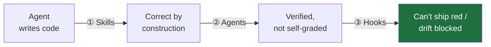

# maru ◯

**Claude Code plugins that enforce Laravel engineering discipline at edit-time — not at PR time.**

Extracted from [Vesna](https://tryvesna.ai), a production Laravel app where these conventions and hooks run in daily development ([provenance](#provenance)).

---

## Why maru exists

Letting a coding agent work autonomously is a bet. It moves fast, but an unguided agent **drifts**: business logic lands in controllers, tests get skipped "just this once", magic strings spread, generated files get hand-edited, and a turn ends with *"done!"* while the suite is red. Ordinary code review catches some of it — at PR time, after the mess is spread across the diff.

maru catches drift **at the moment it happens**, across three layers that each catch what the previous one can't:



| Layer | Fires | What it does |
|---|---|---|
| **① Skills** | *while writing* | Knowledge the agent activates in-flow — where code goes, what a boundary DTO looks like, how to test an LLM call. Prevents bad choices before they're typed. |
| **② Agents** | *on demand, fresh context* | A read-only planner that can't "just quickly implement it", and reviewers that aren't the author grading their own work. |
| **③ Hooks** | *every edit + end of turn* | Deterministic shell guards the model can't rationalize past: format + static-analyze each edited file, hard-block forbidden paths, refuse destructive commands, and (opt-in) refuse to end a turn while tests are red. |

The result: autonomous sessions whose output is **verified, not claimed**.

## Why not just use…?

| Instead of maru | What it gives you | The gap maru fills |
|---|---|---|
| **[Laravel Boost](https://github.com/laravel/boost)** (official) | Laravel *knowledge* — MCP docs, guidelines the agent *may* follow | Knowledge isn't enforcement. maru **gates** — a hook the model can't talk past. *(Install both — [they compose](#pairs-with).)* |
| **Your own `CLAUDE.md` + hooks** | Exactly this — if you build, test, and maintain it | maru is the packaged version: 57 dependency-free hook tests, hardened against real bypasses, production-proven. |
| **CI / linters / PR review** | Catches drift at **PR time**, across the whole diff | maru catches it **at the edit**, before the turn ends — one bad choice, not a diff full of them. |
| **[superpowers](https://github.com/obra/superpowers)** | Generic *process* (brainstorm → spec → plan) | Not a Laravel standard. maru is the *"what good Laravel looks like"* that process executes against. *(They [pair](#pairs-with).)* |

**One line:** maru is the only thing that enforces a Laravel engineering standard at edit-time, with a reviewer that isn't the author and a hook the agent can't rationalize past.

### See it stop something

The `destructive-commands` hook refuses irreversible commands *before* they run — no confirmation the agent can auto-approve:

```console
$ # agent tries to reset the database mid-session
$ sail artisan migrate:fresh --seed

⛔ maru: blocked `migrate:fresh` — this drops every table.
   Refused before execution. Use a reversible migration, or
   run it yourself if you really mean it.
```

Same guard blocks `db:wipe`, `drop database`, `rm -rf /`, git force-push, and destructive `tinker`/`psql` payloads. It **fails closed** — no `jq` on the host, no run.

## Install

Prerequisite: **`jq`** on the host (the safety hooks parse hook JSON with it and refuse to run without it).

```
/plugin marketplace add gurachek/maru
```

| You want | Install | For |
|---|---|---|
| Guard rails only | `/plugin install maru-hooks@maru` | Any Laravel stack |
| The full opinionated kit | `/plugin install maru-core@maru` | TDD agents, reviewers, skills |
| Multi-tenant Postgres RLS | `/plugin install maru-rls@maru` | Tenant-isolation reviewer + skill |

Then, if you installed `maru-core`, in your project:

```
/maru-core:init
```

`init` scaffolds a `CLAUDE.md` (never overwriting an existing one), detects Sail vs. direct binaries and which tools are present, and offers to enable the merge gate. Verify the guard layer yourself: `sh tests/hooks_test.sh` (57 cases).

Install `maru-rls` **only** in multi-tenant apps — its reviewer flags missing tenant scoping as a security finding, which is noise in single-tenant ones.

## What you get

**maru-hooks** — deterministic guards, no config, degrade gracefully (a missing tool is skipped, never blocks; the two safety hooks fail *closed*).

| Name | What it does |
|---|---|
| `php-quality` | Pint + PHPStan on every edited PHP file |
| `js-quality` | Prettier + ESLint on every edited `.vue`/`.ts`/`.tsx` file |
| `forbidden-paths` | blocks edits to `vendor/`, `node_modules/`, `.env*`, build artifacts |
| `destructive-commands` | blocks `migrate:fresh`, `db:wipe`, force-push, and more (fail-closed, project-extensible) |
| `gate-on-green` | **opt-in:** refuses to end a turn while the suite is red |

→ **[docs/hooks.md](docs/hooks.md)** — runner detection, threat model, the concurrency guard.

**maru-core** — the opinionated kit: workflow agents, reviewers, skills.

| Kind | Name | What it does |
|---|---|---|
| Agent | `laravel-planner` | read-only, file-level implementation plans |
| Agent | `tdd-implementer` | the only agent that writes app code; strict red → green |
| Agent | `test-writer` | backfills class-based PHPUnit coverage |
| Agent | `code-reviewer` | SOLID / Laravel idioms / spaghetti review of the diff |
| Agent | `dto-api-reviewer` | DTO-at-boundaries + REST/OpenAPI review |
| Agent | `ui-ux-reviewer` | calm / dense / keyboard-first UI review |
| Skill | 5 skills | feature workflow, DTOs, Prism LLM, frontend, disciplined coding |
| Command | `/maru-core:init` | scaffold `CLAUDE.md`, offer gate-on-green |

→ **[docs/skills.md](docs/skills.md)** — every skill in depth + the detect-and-stand-down ladder.

**maru-rls** — the multi-tenant add-on.

| Kind | Name | What it does |
|---|---|---|
| Agent | `rls-security-reviewer` | tenant-isolation + security review of the diff |
| Skill | `rls-multitenancy` | the Postgres RLS pattern reference |

## Pairs with

- **[Laravel Boost](https://github.com/laravel/boost)** supplies Laravel *knowledge* (MCP tools grounded in 17k+ framework docs); maru supplies *process and enforcement* on top. maru's agents use Boost's MCP tools when present. Where the two conflict (e.g. FormRequests vs. `spatie/laravel-data`), maru's convention wins in projects that use Data objects. **Install both.**
- **[superpowers](https://github.com/obra/superpowers)** supplies the *process* (brainstorm → spec → plan → subagent execution with review gates); maru supplies the *Laravel standard* that process executes against. Used together, plan-executing subagents inherit maru's skills, the reviewers gate each task, and the hooks keep even a misbehaving subagent inside the rails.

## Learn more

- **[docs/hooks.md](docs/hooks.md)** — hooks in depth: fail-open vs. fail-closed, runner detection, the destructive-command threat model, the gate-on-green concurrency guard.
- **[docs/skills.md](docs/skills.md)** — every skill in depth and how detect-and-stand-down keeps them from fighting a foreign stack.
- **[docs/recipes.md](docs/recipes.md)** — end-to-end recipes: bootstrap a project, build a feature, review before a PR, turn on the merge gate, go multi-tenant.

`shadcn-vue` context isn't bundled (it embeds per-project generated context) — install it [upstream](https://www.shadcn-vue.com/docs/cli.html).

## Provenance

maru is extracted from [Vesna](https://tryvesna.ai) — an audit-ready hiring copilot for technical recruiters — where these conventions and hooks run in daily development. maru's opinions *are* Vesna's stack: Laravel + Postgres RLS multi-tenancy, Inertia + Vue 3 + TypeScript, `spatie/laravel-data` at every boundary, Prism for LLM calls, class-based PHPUnit.

## License

MIT.
