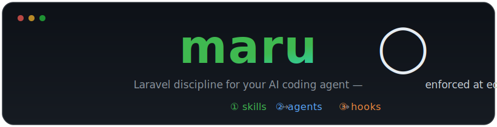
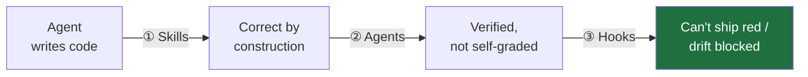

<p align="center">
  
</p>

<p align="center">
  <a href="LICENSE"></a>
  
  
  <a href="https://github.com/gurachek/maru/actions/workflows/tests.yml"></a>
  
</p>

<p align="center"><b>Claude Code plugins that enforce Laravel engineering discipline at edit-time — not at PR time.</b></p>

<p align="center"><sub>Extracted from <a href="https://tryvesna.ai">Vesna</a>, a production Laravel app where these conventions and hooks run daily · <a href="#provenance">provenance</a></sub></p>

---

## Why maru exists

Letting a coding agent work autonomously is a bet. It moves fast, but an unguided agent **drifts**: business logic lands in controllers, tests get skipped "just this once", magic strings spread, generated files get hand-edited, and a turn ends with *"done!"* while the suite is red. Ordinary code review catches some of it — at PR time, after the mess is spread across the diff.

maru catches drift **at the moment it happens**, across three layers that each catch what the previous one can't:



| Layer | Fires | What it does |
|---|---|---|
| **① Skills** | *while writing* | Knowledge the agent activates in-flow — where code goes, what a boundary DTO looks like, how to test an LLM call. Prevents bad choices before they're typed. |
| **② Agents** | *on demand, fresh context* | A read-only planner that can't "just quickly implement it", and reviewers that aren't the author grading their own work. |
| **③ Hooks** | *every edit + end of turn* | Deterministic shell guards the model can't rationalize past: format + static-analyze each edited file, hard-block forbidden paths, refuse destructive commands, and (opt-in) refuse to end a turn while tests are red. |

The result: autonomous sessions whose output is **verified, not claimed**.

## In practice

You ask for a feature the way you always would:

> *"Add an endpoint to invite a teammate to an organization."*

What comes back isn't a fat controller you'll spend the next 20 minutes reshaping in review:

- **`laravel-planner`** returns a file-level plan — module, DTOs, Action, migration, the exact tests — with open questions listed, not guessed.
- **`tdd-implementer`** writes the failing test first, then the minimal `request → DTO → Action → response`.
- Every saved file is **Pint-formatted and PHPStan-checked on the spot**, and the turn **can't end while the suite is red**.

So you review **decisions, not codestyle.** No *"extract this to an Action,"* no *"this should be an enum,"* no fix-the-formatting loop — that's settled before the diff reaches you.

### What lands in the diff

Left to its own devices, an agent optimizes for *make it work* — logic in the controller, no boundary, a magic string, an Eloquent model leaked out:

```php
// ❌ unguided: fat controller, inline logic, stringly-typed
public function store(Request $request)
{
    $data = $request->validate([/* ... */]);
    if ($data['role'] === 'admin') { /* ... */ }   // magic string
    $member = OrganizationMember::create($data);    // business logic inline
    return $member;                                 // Eloquent model leaked
}
```

With the `laravel-feature` + `dto-openapi` skills steering and the hooks enforcing, the same request lands as a thin controller over a validated boundary and an Action:

```php
// ✅ maru: validate → DTO → Action → response
public function store(InviteTeammateData $data, InviteTeammate $action): JsonResponse
{
    return response()->json($action($data), 201);
}
```

`InviteTeammateData` is a `spatie/laravel-data` object with validation on the class; `InviteTeammate` is a single-`__invoke` Action returning a DTO (never an Eloquent model); `Role` is a backed enum — all `declare(strict_types=1)`, Pint-clean and PHPStan-green before you see it. The validation moved onto the Data class and the branching into the Action — the complexity didn't vanish, it moved out of the controller to where it belongs.

> **Honest split:** the **hooks guarantee** the mechanical layer — formatting, static analysis, a green suite — deterministically. The **skills steer** the architecture. An LLM isn't deterministic, but out of the box the shape it reaches for is the one on the right, not the one on the left.

## Why not just use…?

| Instead of maru | What it gives you | The gap maru fills |
|---|---|---|
| **[Laravel Boost](https://github.com/laravel/boost)** (official) | Laravel *knowledge* — MCP docs, guidelines the agent *may* follow | Knowledge isn't enforcement. maru **gates** — a hook the model can't talk past. *(Install both — [they compose](#pairs-with).)* |
| **Your own `CLAUDE.md` + hooks** | Exactly this — if you build, test, and maintain it | maru is the packaged version: 64 hook tests in pure `sh` (no framework, run in CI) covering real bypasses — bundled `-uf` flags, the `--force-with-lease` decoy, `+refspec` force — and it's run daily on one production app. |
| **CI / linters / PR review** | Catches drift at **PR time**, across the whole diff | maru catches it **at the edit**, before the turn ends — one bad choice, not a diff full of them. |
| **[superpowers](https://github.com/obra/superpowers)** | Generic *process* (brainstorm → spec → plan) | Not a Laravel standard. maru is the *"what good Laravel looks like"* that process executes against. *(They [pair](#pairs-with).)* |

**In short:** maru enforces a Laravel engineering standard at edit-time — a reviewer that isn't the author, and a hook the agent can't rationalize past.

**What it won't do:** it governs *how* code is written, not *whether* the feature is the right one — a weak plan still needs your judgment — and the command guards are accident-prevention, not a security sandbox.

### See it stop something

The `destructive-commands` hook refuses irreversible commands *before* they run — no confirmation the agent can auto-approve:



Same guard blocks `db:wipe`, `drop database`, `rm -rf /` (root only), git force-push, and destructive `tinker`/`psql` payloads. It **fails closed** — no `jq` on the host, no run. It's an *accident* guard, not a sandbox — the durable floor underneath is still DB backups and a non-superuser role ([threat model](docs/hooks.md)).

## Install

Prerequisite: **`jq`** on the host (the safety hooks parse hook JSON with it and refuse to run without it).

```
/plugin marketplace add gurachek/maru
```

| You want | Install | For |
|---|---|---|
| Guard rails only | `/plugin install maru-hooks@maru` | Any Laravel stack |
| The full opinionated kit | `/plugin install maru-core@maru` | TDD agents, reviewers, skills |
| Multi-tenant Postgres RLS | `/plugin install maru-rls@maru` | Tenant-isolation reviewer + skill |

Then, if you installed `maru-core`, in your project:

```
/maru-core:init
```

`init` scaffolds a `CLAUDE.md` (never overwriting an existing one), detects Sail vs. direct binaries and which tools are present, and offers to enable the `gate-on-green` stop hook. Verify the guard layer yourself: `sh tests/hooks_test.sh` (64 cases, also run in CI).

Install `maru-rls` **only** in multi-tenant apps — its reviewer flags missing tenant scoping as a security finding, which is noise in single-tenant ones.

## What it touches

- **Your project:** only `/maru-core:init` writes to your repo — it scaffolds a `CLAUDE.md` (never overwriting an existing one) and, if you opt in, an empty `.claude/gate-on-green` marker. Nothing else.
- **Everything else** — hooks, agents, skills — lives in Claude Code's plugin dir under `~/.claude`, not your repo. It's shell scripts and markdown that run locally: **no telemetry, no network calls.**
- **Requirements:** Claude Code, plus `jq` for the safety hooks. The quality hooks use your project's Pint / PHPStan / Prettier / ESLint when present and silently skip when absent — install only what you want enforced.
- **Remove it:** `claude plugin uninstall maru-hooks@maru` (likewise for the others), or disable one from `/plugin`. Your own `.claude/settings.json` hooks always compose with, and can override, maru's.

## What you get

> **Won't fight your existing stack.** On a Pest / FormRequest / no-modules project the opinionated skills and reviewers detect the difference and stand down — keeping the universal principles (thin controllers, test-first, validated boundaries) and dropping the house-style specifics. ([how](docs/skills.md))

**maru-hooks** — deterministic guards, no config, degrade gracefully (a missing tool is skipped, never blocks; the two safety hooks fail *closed*).

| Name | What it does |
|---|---|
| `php-quality` | Pint + PHPStan on every edited PHP file |
| `js-quality` | Prettier + ESLint on every edited `.vue`/`.ts`/`.tsx` file |
| `forbidden-paths` | blocks edits to `vendor/`, `node_modules/`, `.env*`, build artifacts |
| `destructive-commands` | blocks `migrate:fresh`, `db:wipe`, force-push, and more (fail-closed, project-extensible) |
| `gate-on-green` | **opt-in:** refuses to end a turn while the suite is red |

→ **[docs/hooks.md](docs/hooks.md)** — runner detection, threat model, the concurrency guard.

**maru-core** — the opinionated kit: workflow agents, reviewers, skills.

| Kind | Name | What it does |
|---|---|---|
| Agent | `laravel-planner` | read-only, file-level implementation plans |
| Agent | `tdd-implementer` | the only agent that writes app code; strict red → green |
| Agent | `test-writer` | backfills class-based PHPUnit coverage |
| Agent | `code-reviewer` | SOLID / Laravel idioms / spaghetti review of the diff |
| Agent | `dto-api-reviewer` | DTO-at-boundaries + REST/OpenAPI review |
| Agent | `ui-ux-reviewer` | calm / dense / keyboard-first UI review |
| Skill | `laravel-feature` | the `request → DTO → Action → response` feature workflow |
| Skill | `dto-openapi` | `spatie/laravel-data` at every boundary + REST/OpenAPI contract |
| Skill | `prism-llm` | LLM calls behind a service, an audit row per call, `Prism::fake()` tests |
| Skill | `frontend-design` | calm / dense / keyboard-first Inertia/Vue rules |
| Skill | `disciplined-coding` | test-first, small commits, file-size limits |
| Command | `/maru-core:init` | scaffold `CLAUDE.md`, offer gate-on-green |

→ **[docs/skills.md](docs/skills.md)** — every skill in depth + the detect-and-stand-down ladder.

**maru-rls** — the multi-tenant add-on.

| Kind | Name | What it does |
|---|---|---|
| Agent | `rls-security-reviewer` | tenant-isolation + security review of the diff |
| Skill | `rls-multitenancy` | the Postgres RLS pattern reference |

## Pairs with

- **[Laravel Boost](https://github.com/laravel/boost)** supplies Laravel *knowledge* (MCP tools grounded in 17k+ framework docs); maru supplies *process and enforcement* on top. maru's agents use Boost's MCP tools when present. Where the two conflict (e.g. FormRequests vs. `spatie/laravel-data`), maru's convention wins in projects that use Data objects. **Install both.**
- **[superpowers](https://github.com/obra/superpowers)** supplies the *process* (brainstorm → spec → plan → subagent execution with review gates); maru supplies the *Laravel standard* that process executes against. Used together, plan-executing subagents inherit maru's skills, the reviewers gate each task, and the hooks keep even a misbehaving subagent inside the rails.

## Learn more

- **[docs/hooks.md](docs/hooks.md)** — hooks in depth: fail-open vs. fail-closed, runner detection, the destructive-command threat model, the gate-on-green concurrency guard.
- **[docs/skills.md](docs/skills.md)** — every skill in depth and how detect-and-stand-down keeps them from fighting a foreign stack.
- **[docs/recipes.md](docs/recipes.md)** — end-to-end recipes: bootstrap a project, build a feature, review before a PR, turn on the merge gate, go multi-tenant.

`shadcn-vue` context isn't bundled (it embeds per-project generated context) — install it [upstream](https://www.shadcn-vue.com/docs/cli.html).

## Provenance

maru is extracted from [Vesna](https://tryvesna.ai) — an audit-ready hiring copilot for technical recruiters — where these conventions and hooks run in daily development. maru's opinions *are* Vesna's stack: Laravel + Postgres RLS multi-tenancy, Inertia + Vue 3 + TypeScript, `spatie/laravel-data` at every boundary, Prism for LLM calls, class-based PHPUnit.

## Author

Built by **[Valerii Hurachek](https://github.com/gurachek)** — 9 years as a software engineer, most of it in PHP, across startups, freelance, outsourcing, govtech, and enterprise. maru is the engineering standard I converged on over those years, extracted from [Vesna](https://tryvesna.ai).

## License

MIT.
